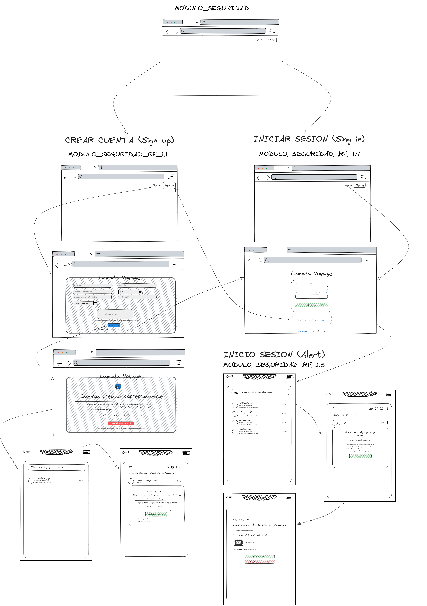
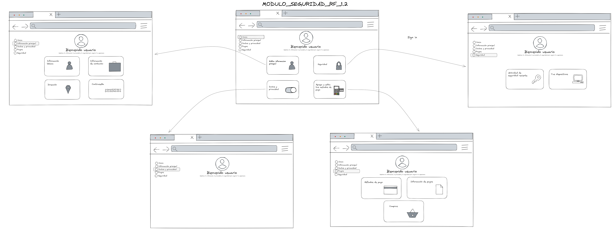
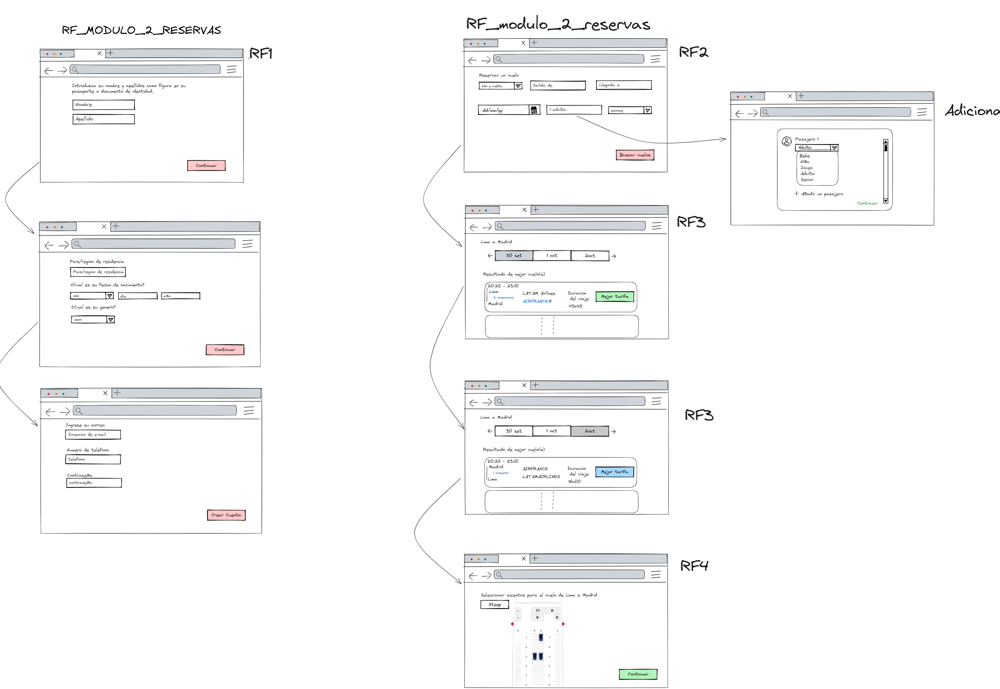
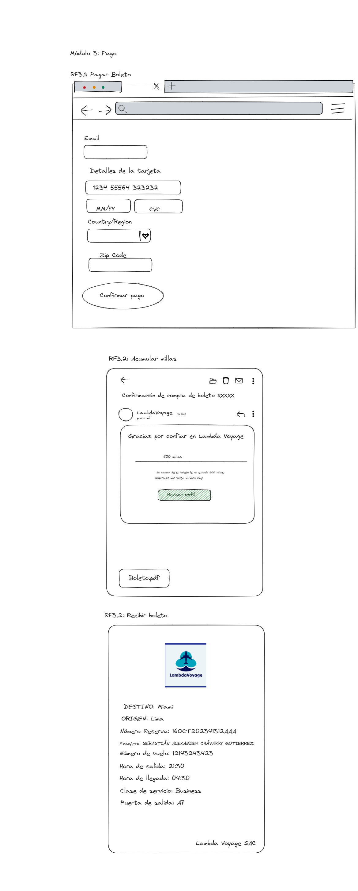
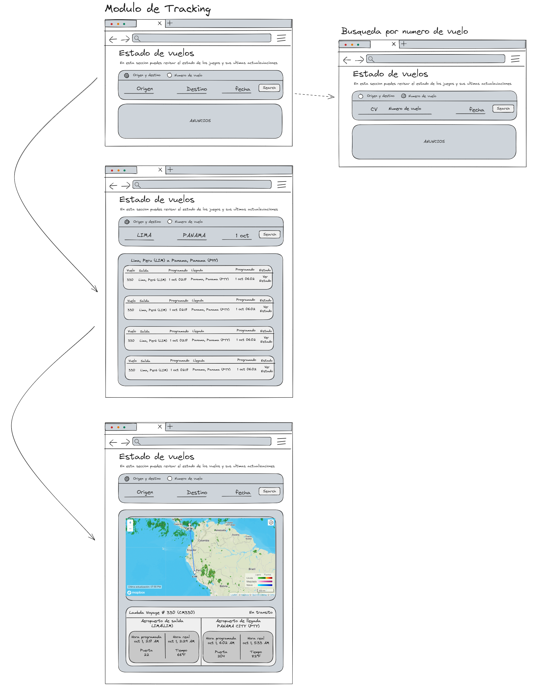
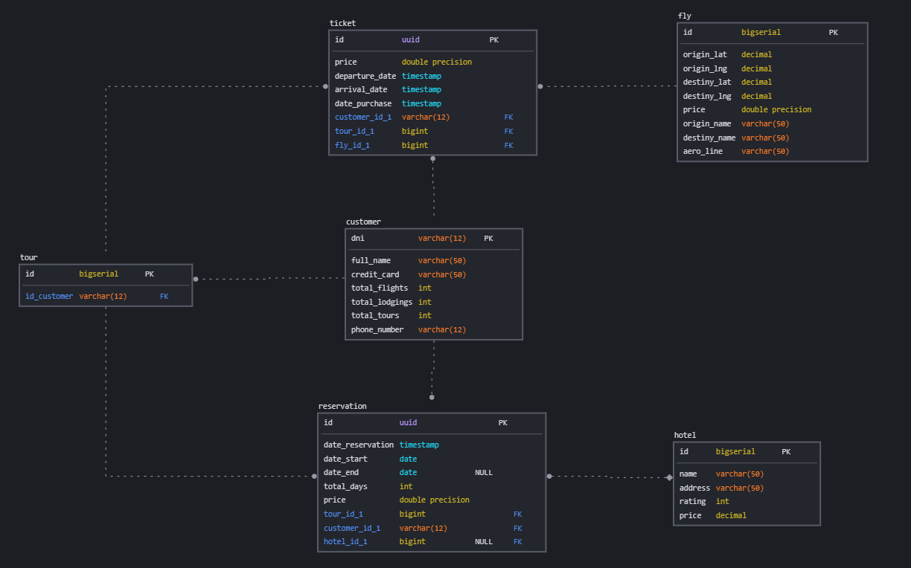
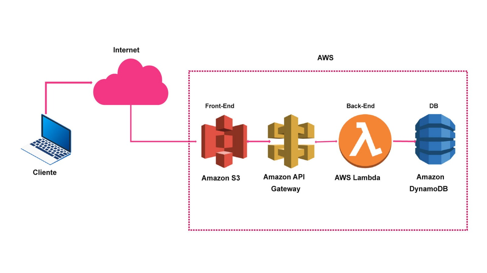

# ULAS-PF
# Arquitectura de Software Grupo 03
## Integrantes
* Steep Bratzon Salvador Mancisidor 
* Gustavo Jesus Yupanqui Tarazona
* Sebastian Alexander Chavarry Gutierrez
* Frank Antonio Caldas Calderon
## Tema de proyecto: Ecommerce de aerolínea
Vamos a desarrollar un ecommerce que permita comprar boletos para distintos vuelos nacionales e internacionales de una aerolínea, involucrando así el uso de tacticas y el uso de tecnologias backend para los distintos módulos que existan segun la necesidad.

Link de avance: https://docs.google.com/document/d/196nMjduarvR2hKu1R4DtyDnqM2pSTqry659cAHEADwk/edit?usp=sharing

**1. Caso de Negocio**

**1.1. Generalidades**

**Nombre del startup** : Lambda Voyage

La relación entre consumidores y aerolíneas va en declive. Según el Reporte de Estadísticas Institucionales en 2019, el transporte por vía área ocupa la segunda mayor cantidad de reclamos solo en Perú. Ante esta situación, la familia Lambda busca transformar la experiencia de viajes en latinoamérica centrándose en una experiencia del consumidor A1 desde inicio a fin del vuelo. Por ello, utilizando su larga experiencia en el rubro de las aerolíneas deciden fundar "LambdaVoyage", una empresa de aerolínea que busca proporcionar una experiencia cómoda de viaje a todos sus clientes en todas las etapas del viaje. Para ello, buscó financiamiento del Ministerio de Turismo, el cual recientemente les proporcionó el dinero suficiente para poder financiar toda la logística de la empresa. Debido a su experiencia previa lograron rápidamente conseguir los aviones y pilotos necesarios cómo para comenzar a despegar. No obstante, todavía les faltaba un factor importante para comenzar a generar ingresos: La página web. Los fundadores no tienen muchos conocimientos en Informática, por lo cual contrataron a "SS Consulting", una consultora de desarrollo de software para que construyan la primera página funcional de su empresa. Actualmente buscan maximizar los ingresos, mientras que mantienen los costos de operación bajos. Por lo tanto, su principal preocupación es que su página web sea funcional y responda a las necesidades de negocio que tienen para que los clientes puedan disfrutar al máximo su experiencia de viaje.

**1.2. Modelo de Negocio**

**Canvas de Modelo de Negocio**

_Propuesta de valor_:

- Venta de boletos aéreos y paquetes de viaje.
- Experiencia de viaje sin problemas y conveniente.
- Precios competitivos
- Personalización de viajes
- Servicio al cliente excepcional

_Segmentos de Cliente_:

- Viajeros frecuentes
- Viajeros de negocios
- Viajeros de placer
- Grupos turísticos
- Empresas que requieren servicios de viaje para empleados

Canales de Distribución:

- Sitio web de LambdaVoyage
- Alianzas con aerolíneas

_Relaciones con los Clientes:_

- Soporte en línea 24/7
- Servicio de atención al cliente
- Programa de fidelización para viajeros frecuentes

_Fuentes de Ingresos_:

- Comisiones por reservas de vuelos

- Publicidad y promoción de socios

_Recursos Clave:_

- Plataforma web
- Base de datos de vuelos
- Personal de atención al cliente
- Alianzas estratégicas con aerolíneas y hoteles

_Actividades Clave:_

- Desarrollo y mantenimiento de la plataforma web
- Negociación y gestión de alianzas con proveedores de viajes
- Servicio de atención al cliente

_Socios Clave:_

- Aerolíneas
- Hoteles
- Compañías de alquiler de autos
- Proveedores de actividades y excursiones

_Estructura de Costos:_

- Desarrollo y mantenimiento de la plataforma
- Salarios del personal
- Gastos de marketing y publicidad
- Comisiones a socios

**1.3. Estructura del Equipo**

Nuestro equipo está formado por profesionales con experiencia en tecnología, turismo y atención al cliente:

- CEO: Encargado de la visión y estrategia general.
- CTO: Responsable del desarrollo y mantenimiento de la plataforma web.
- COO: Encargado de las operaciones diarias y alianzas estratégicas.
- Equipo de Desarrollo: Ingenieros y diseñadores que trabajan en la plataforma web.
- Equipo de Atención al Cliente: Agentes de soporte en línea y atención al cliente.
- Equipo de Marketing: Responsable de la promoción y publicidad de LambdaVoyage.

**1.4. Listado de Stakeholders**

| **Stakeholder** | **Rol** | **Responsabilidad** | **Interés en la arquitectura** |
| --- | --- | --- | --- |
| Viajeros individuales | Cliente | Paga por los servicios de LambdaVoyage | Asegurar la funcionalidad y calidad de los productos |
| Empresas | Cliente | Paga por los servicios de LambdaVoyage | Asegurar la funcionalidad y calidad de los productos |
| Proveedores de servicios de viaje (aerolíneas, hoteles, compañías de alquiler de autos) | Administrador de Línea de Producto | Desarrolla una familia de productos con los elementos similares | Determinar si un miembro de la familia de productos se ajusta al objetivo global |
| Inversionistas y accionistas | Conformance Checker | Asegurar los estándares y procesos del producto | Asegurar que los avances siguen la arquitectura planteada |
| Reguladores y organismos gubernamentales | Representante de Sistema Externo | Responsable del manejo de un sistema con que debemos interactuar | Definir condiciones del acuerdo entre sistemas |
| Socios estratégicos | Evaluador | Conducir una evaluación formal de la arquitectura | Evaluar la capacidad de la arquitectura para entregar funcionalidades y atributos |
| Colaboradores | Ingeniero de sistemas | Responsable del diseño de sistemas o componentes | Asegurar el entorno provisto por el sistema |
| Alianzas aéreas | Diseñador | Diseño de software para cumplir los requerimientos de los módulos | Resolver problemas de contención de recursos |

**2. Requerimientos del Sistema**

**2.1 Módulo de seguridad**

**2.1.1 Requisitos funcionales**

| ID | Nombre | Historia de Usuario |
| --- | --- | --- |
| RF1.1 | Crear cuenta. | Yo, como usuario, quiero poder generar mi cuenta con mi correo de gmail y recibir una notificación de validación para acelerar mi proceso de acceso a la plataforma. |
| RF.1.2 | Editar información personal. | Yo, como usuario, quiero poder modificar toda mi información personal para actualizar algún valor determinado. |
| RF1.3 | Recibir alertas de seguridad | Yo, como usuario, quiero recibir alertas de seguridad en mi celular cuando inicie sesión en un nuevo dispositivo para tener trazabilidad de mi cuenta. |
| RF1.4 | Iniciar sesión | Yo, como usuario, quiero poder autenticar el inicio de sesión utilizando un código que envié a mi teléfono para aumentar la seguridad de mi cuenta. |

**2.1.2 Escenarios a nivel de atributos de calidad**

| **Escenario de atributo de calidad** | ACS001 |
| --- | --- |
| **Atributo de calidad** | Seguridad |
| **Nombre** | Seguridad de datos y transacciones |
| **Fuente del estímulo** | Usuarios de LambdaVoyage |
| **Estímulo** | Envío de datos personales y transacciones en línea |
| **Entorno** | En línea (cualquier momento) |
| **Artefacto** | Sitio web de LambdaVoyage y bases de datos |
| **Respuesta** | Los datos de los usuarios y las transacciones en línea están protegidos y seguros. |
| **Medida de la respuesta** | Que los datos se envíen de forma segura utilizando alguna medida de seguridad. Que los datos comprometidos sean 0%. |

| **Escenario de atributo de calidad** | ACS002 |
| --- | --- |
| **Atributo de calidad** | Seguridad |
| **Nombre** | Seguridad de Envío de Datos de Información Financiera |
| **Fuente del estímulo** | Usuario de LambdaVoyage |
| **Estímulo** | Envío de datos de información financiera |
| **Entorno** | Página web LambdaVoyage |
| **Artefacto** | Mecanismo de seguridad de la página web |
| **Respuesta** | Seguridad mejorada en el envío de datos financieros |
| **Medida de la respuesta** | Tiempo promedio de respuesta del sistema en milisegundos para transacciones financieras de menos de 200 ms |

| **Escenario de atributo de calidad** | ACS003 |
| --- | --- |
| **Atributo de calidad** | Seguridad |
| **Nombre** | Seguridad durante el Inicio de Sesión en un Nuevo Dispositivo |
| **Fuente del estímulo** | Usuario que intenta iniciar sesión en un nuevo dispositivo |
| **Estímulo** | Intento de inicio de sesión en un dispositivo no reconocido |
| **Entorno** | Sistema de autenticación de la plataforma o servicio web |
| **Artefacto** | Mecanismo de autenticación y seguridad del sistema |
| **Respuesta** | Verificación y autorización exitosa del usuario o denegación en caso de falla en la autenticación |
| **Medida de la respuesta** | Tasa de éxito en la autenticación en nuevos dispositivos (99.9%) |

| **Escenario de atributo de calidad** | ACS004 |
| --- | --- |
| **Atributo de calidad** | Seguridad |
| **Nombre** | Seguridad frente a Ataque "Man-in-the-Middle" |
| **Fuente del estímulo** | Atacante que intenta realizar un ataque "Man-in-the-Middle" |
| **Estímulo** | Intento de interceptar y manipular las comunicaciones entre un usuario y la página web LambdaVoyage |
| **Entorno** | Comunicación entre el usuario y la página web LambdaVoyage |
| **Artefacto** | Mecanismos de seguridad y protocolos de cifrado utilizados en la comunicación |
| **Respuesta** | Detección y prevención del ataque "Man-in-the-Middle"
 |
| **Medida de la respuesta** | Tiempo promedio necesario para detectar y mitigar un ataque en 20 segundos |

| **Escenario de atributo de calidad** | ACS005 |
| --- | --- |
| **Atributo de calidad** | Seguridad |
| **Nombre** | Prevención de Ataques de Inyección SQL en Inicio de Sesión o Registro |
| **Fuente del estímulo** | Atacante que intenta realizar un ataque de inyección SQL |
| **Estímulo** | Intento de inyección SQL en los campos de inicio de sesión o registro |
| **Entorno** | Proceso de inicio de sesión o registro en la página web LambdaVoyage |
| **Artefacto** | Mecanismos de seguridad y validación de entrada de datos |
| **Respuesta** | Detección y prevención de ataques de inyección SQL |
| **Medida de la respuesta** | Tiempo promedio necesario para detectar y mitigar un ataque en 20 segundos |

| **Escenario de atributo de calidad** | ACS006 |
| --- | --- |
| **Atributo de calidad** | Confiabilidad |
| **Nombre** | Confianza en la disponibilidad y funcionamiento |
| **Fuente del estímulo** | Usuarios de LambdaVoyage |
| **Estímulo** | Interacción con el sitio web de LambdaVoyage |
| **Entorno** | En línea |
| **Artefacto** | Sitio web de LambdaVoyage |
| **Respuesta** | Los usuarios confían en que el sitio web de LambdaVoyage estará disponible y funciona correctamente cuando lo necesiten. |
| **Medida de la respuesta** | El tiempo promedio que pasa entre las fallas del sitio web. Objetivo: Un MTBF alto, que indica una baja frecuencia de fallas. |

| **Escenario de atributo de calidad** | ACS008 |
| --- | --- |
| **Atributo de calidad** | Mantenibilidad |
| **Nombre** | Implementación de actualizaciones de software |
| **Fuente del estímulo** | Desarrolladores de LambdaVoyage |
| **Estímulo** | Lanzar nuevas actualizaciones con nuevas características y corrección de errores. |
| **Entorno** | En línea (fuera de las horas pico del tráfico de datos) |
| **Artefacto** | Código fuente, sistemas de control de versiones. |
| **Respuesta** | La actualización se implementa sin interrupciones significativas en el servicio. |
| **Medida de la respuesta** | Tiempo de inactividad durante la implementación de la actualización (preferiblemente mínimo). |

**2.1.3 Restricciones**

I **ntegración de proveedores externos:**

LambdaVoyage puede depender de sistemas y servicios proporcionados por terceros, como procesadores de pagos, proveedores de servicios en la nube y sistemas de gestión de reservas de aerolíneas. Estos proveedores pueden tener sus propias políticas y medidas de seguridad que deben ser consideradas en la implementación de la seguridad de LambdaVoyage. Esto hace que la empresa pueda estar limitada en cuanto a la configuración de ciertos aspectos de la seguridad cuando se trata de sistemas y servicios de terceros. Por lo cual, la empresa debe trabajar en estrecha colaboración con estos proveedores para garantizar que se cumplan las medidas de seguridad requeridas y que se mantenga un nivel adecuado de protección para los datos y transacciones de los clientes.

**Cumplimientos normativos gubernamentales y externos**

LambdaVoyage podría estar sujeta a regulaciones y estándares de seguridad establecidos por autoridades externas, como agencias gubernamentales de aviación o entidades reguladoras de servicios financieros. Esto podría incluir regulaciones relacionadas con la privacidad de los datos de los clientes, la seguridad de las transacciones financieras y la protección de la información personal. La empresa debe asegurarse de que sus módulos de seguridad cumplan con los requisitos y estándares establecidos por estas entidades, lo que puede limitar ciertas configuraciones o tecnologías que se pueden implementar. Por otra parte, la empresa no tiene influencia directa sobre la formulación de estas regulaciones, por lo que debe adaptar sus módulos de seguridad para cumplir con ellas, lo que a veces puede ser costoso y complejo.

**Regulaciones y estándares de seguridad**

La plataforma de LambdaVoyage podría estar sujeta a regulaciones y estándares de seguridad específicos del sector de viajes y pagos en línea. Estos requisitos pueden incluir el cumplimiento de normativas como el Reglamento General de Protección de Datos (GDPR) para proteger la privacidad de los datos del cliente, así como estándares de seguridad de la industria de pagos (por ejemplo, PCI DSS como estándar de Seguridad de Datos para la Industria de Tarjetas de Pago) para garantizar la seguridad de las transacciones financieras. La empresa debe asegurarse de que su plataforma cumple con todos los requisitos normativos establecidos, lo que puede requerir la implementación de ciertas medidas de seguridad específicas y auditorías regulares para garantizar el cumplimiento, incluyendo la protección de la información de tarjetas de crédito y la prevención de fraudes en transacciones.

**2.2 Módulo reservas**

**2.2.1 Requisitos funcionales**

| ID | Nombre | Historia de Usuario |
| --- | --- | --- |
| RF2.1 | Filtrar vuelos | Yo, como usuario, quiero completar filtros, para que el sistema me muestra un catálogo de vuelos que cumplan con mis intereses. |
| RF2.2 | Seleccionar vuelo. | Yo, como usuario, quiero seleccionar el vuelo de mi interés, para proceder con la selección de mi asiento. |
| RF2.3 | Seleccionar asiento. | Yo, como usuario, quiero seleccionar el asiento dentro del vuelo seleccionado, para reservar mi lugar y continuar con la pasarela de pago. |
| RF2.4 | Llenar información | Yo, como usuario, quiero llenar información para la reserva de boletos, para agregar un pasajero adicional. |
| RF2.5 | Ver datos de vuelo | Yo, como usuario, quiero ver los datos de vuelo del avión (salida, destino, hora de embarque, etc), para identificar cada vuelo. |

**2.2.2 Escenarios a nivel de atributos de calidad**

| **Escenario de atributo de calidad** | ACR001 |
| --- | --- |
| **Atributo de calidad** | Rendimiento |
| **Nombre** | Rendimiento de carga y procesamiento |
| **Fuente del estímulo** | Usuarios de LambdaVoyage |
| **Estímulo** | Carga de páginas y procesamiento de reservas |
| **Entorno** | En línea (Durante las horas de operación normales con un nivel de tráfico promedio) |
| **Artefacto** | Sitio web de LambdaVoyage y sistema de reservas. |
| **Respuesta** | Las páginas del sitio web se cargan de manera rápida y eficiente, y las reservas se procesan sin demoras significativas. |
| **Medida de la respuesta** | Tiempo de carga de página promedio inferior a 2 segundos y procesamiento de reservas en menos de 5 segundos. |

| **Escenario de atributo de calidad** | ACR002 |
| --- | --- |
| **Atributo de calidad** | Rendimiento |
| **Nombre** | Rendimiento de búsqueda de vuelos |
| **Fuente del estímulo** | Usuarios de LambdaVoyage |
| **Estímulo** | Búsqueda de vuelos en el sitio web de LambdaVoyage |
| **Entorno** | En línea (Durante las horas de operación normales con un nivel de tráfico promedio) |
| **Artefacto** | Motor de búsqueda de vuelos en el sitio web de LambdaVoyage |
| **Respuesta** | Los resultados de búsqueda de vuelos se generan de manera rápida y eficiente. |
| **Medida de la respuesta** | Tiempo de respuesta del motor de búsqueda de vuelos inferior a 3 segundos. |

| **Escenario de atributo de calidad** | ACR003 |
| --- | --- |
| **Atributo de calidad** | Escalabilidad |
| **Nombre** | Capacidad de crecimiento (aumento del tráfico de usuarios) |
| **Fuente del estímulo** | Crecimiento de Usuarios en LambdaVoyage (activos) |
| **Estímulo** | La plataforma experimenta un aumento repentino en la cantidad de usuarios activos. |
| **Entorno** | Eventos, promociones,etc que generan más demanda de tráfico. |
| **Artefacto** | Servidores, sistema de equilibrio de carga. |
| **Respuesta** | La plataforma puede manejar el aumento de usuarios sin generar problemas en el rendimiento. |
| **Medida de la respuesta** | Capacidad de la plataforma para escalar y mantener el rendimiento (por ejemplo, aumento del 200% en tráfico sin pérdida de velocidad). |

| **Escenario de atributo de calidad** | ACR004 |
| --- | --- |
| **Atributo de calidad** | Usabilidad |
| **Nombre** | Realización de reservas de vuelos sin asistencia |
| **Fuente del estímulo** | Los usuarios intentan reservar su vuelo y asiento por sí mismos |
| **Estímulo** | El usuario inicia sesión y realiza la reserva de vuelo sin requerimientos de asistencia. |
| **Entorno** | En línea (durante las horas de operaciones) |
| **Artefacto** | Interfaz de usuario, flujo de reserva de vuelos. |
| **Respuesta** | El usuario completa la reserva de vuelo sin problemas y de manera intuitiva. |
| **Medida de la respuesta** | el porcentaje de usuarios que completan la reserva sin asistencia. |

**2.2.3 Restricciones**

**Disponibilidad y capacidad de asientos por vuelo**

Los horarios de operación de los aeropuertos están determinados por las autoridades aeroportuarias y no pueden ser modificados por la empresa. Así mismo, los vuelos deben ser programados dentro de los horarios de operación establecidos por los aeropuertos, lo que puede limitar las opciones de disponibilidad para los clientes. Por otro lado, la capacidad de los aviones utilizados en los vuelos está determinada por las especificaciones de los fabricantes y no puede ser alterada por LambdaVoyage. Se tiene en cuenta que la cantidad de asientos disponibles está sujeta a las políticas y operaciones de las aerolíneas, lo que puede limitar las opciones de reserva para ciertos destinos o fechas.

**Horario y rutas de vuelo**

Los horarios y rutas de vuelo están sujetos a acuerdos con aerolíneas y restricciones impuestas por autoridades de aviación civil, por lo cual no pueden ser modificados por LambdaVoyage. Por lo cual, los usuarios deben seleccionar entre los horarios de vuelo predefinidos, lo que puede limitar la flexibilidad en la planificación de viajes y la disponibilidad de vuelos en función de las restricciones de tiempo de las aerolíneas.

**Política de cancelación y reembolso**

La empresa entiende que los proveedores de servicios de viaje, como aerolíneas, hoteles y agencias de alquiler de automóviles, tienen sus propias políticas de cancelación y reembolso; estos pueden variar según la tarifa del boleto y estar fuera del control de la empresa. Esto significa que los usuarios pueden estar sujetos a restricciones específicas en cuanto a la cancelación o modificación de sus reservas, según las políticas de los proveedores. Puede incluir condiciones específicas sobre fechas límite, cargos por cancelación, costos adicionales en caso de cambios en los planes de viaje y restricciones de reembolso.

**Conexiones con otras aerolíneas**

Algunas aerolíneas pueden tener acuerdos o restricciones específicas con respecto a las conexiones de vuelos, lo cual está fuera del control directo de LambdaVoyage.Es por eso que la disponibilidad de vuelos de conexión y las opciones de itinerario pueden estar influenciadas por las políticas de las aerolíneas asociadas.

**2.3 Módulo de pago**

**2.3.1 Requisitos funcionales**

| ID | Nombre | Historia de Usuario |
| --- | --- | --- |
| RF3.1 | Pagar boleto | Yo, como usuario, quiero realizar el pago de mi boleto seleccionado, para confirmar mi compra. |
| RF3.2 | Acumular millas | Yo, como usuario, quiero que el sistema me envíe un correo indicando cuántas millas he ganado por la compra de mi boleto, para saber el estado actual de mis millas. |
| RF3.3 | Recibir boleto | Yo, como usuario, quiero recibir el boleto con los detalles de mi vuelo en mi correo, para saber la información de mi vuelo |

**2.3.2 Escenarios a nivel de atributos de calidad**

| **Escenario de atributo de calidad** | ACP001 |
| --- | --- |
| **Atributo de calidad** | Disponibilidad |
| **Nombre** | Disponibilidad 24/7 |
| **Fuente del estímulo** | Usuarios de LambdaVoyage |
| **Estímulo** | Acceso al sitio web de LambdaVoyage |
| **Entorno** | En línea (Durante horas de operación normales con un nivel de tráfico promedio) |
| **Artefacto** | Sitio web de LambdaVoyage |
| **Respuesta** | El sitio web de LambdaVoyage está disponible sin interrupciones las 24 horas del día, los 7 días de la semana. |
| **Medida de la respuesta** | Disponibilidad de 99.9% con un máximo de 8.76 horas al año. |

| **Escenario de atributo de calidad** | ACP002 |
| --- | --- |
| **Atributo de calidad** | Disponibilidad |
| **Nombre** | Disponibilidad del proceso de pago |
| **Fuente del estímulo** | Usuarios de LambdaVoyage |
| **Estímulo** | Interrupción del proceso de pago debido a pérdida de conexión a Internet o intento de cerrar la página |
| **Entorno** | En línea (Durante las horas de operación normales con un nivel de tráfico promedio) |
| **Artefacto** | Sistema de procesamiento de pagos en el sitio web de LambdaVoyage |
| **Respuesta** | El sistema de procesamiento de pagos debe mantener la disponibilidad y permitir una recuperación sin problemas después de una interrupción. |
| **Medida de la respuesta** | El sistema debe ser capaz de recuperarse automáticamente después de una interrupción en un plazo de 2 minutos. |

| **Escenario de atributo de calidad** | ACP003 |
| --- | --- |
| **Atributo de calidad** | Escalabilidad |
| **Nombre** | Capacidad para expandir la funcionalidad en tiempo real |
| **Fuente del estímulo** | Cambios en los requerimientos funcionales del sitio web |
| **Estímulo** | Introducción de nuevas características y funcionalidades |
| **Entorno** | En línea |
| **Artefacto** | Sitio web de LambdaVoyage |
| **Respuesta** | El sitio web de LambdaVoyage es capaz de expandir su funcionalidad para incorporar nuevas características y servicios sin afectar negativamente la estabilidad ni la experiencia de usuario existente. |
| **Medida de la respuesta** | Que el 80% de los usuarios estén conformes según una encuesta con la experiencia de usuario sobre las nuevas características y funcionalidades agregadas. |

| **Escenario de atributo de calidad** | ACP004 |
| --- | --- |
| **Atributo de calidad** | Disponibilidad |
| **Nombre** | Disponibilidad 24/7 |
| **Fuente del estímulo** | Usuarios de LambdaVoyage |
| **Estímulo** | Acceso al sitio web de LambdaVoyage |
| **Entorno** | En línea (Durante horas de operación normales con un nivel de tráfico promedio) |
| **Artefacto** | Sitio web de LambdaVoyage |
| **Respuesta** | El sitio web de LambdaVoyage está disponible sin interrupciones las 24 horas del día, los 7 días de la semana. |
| **Medida de la respuesta** | Disponibilidad de 99.9% con un máximo de 8.76 horas al año. |

| **Escenario de atributo de calidad** | ACP005 |
| --- | --- |
| **Atributo de calidad** | Usabilidad |
| **Nombre** | Usabilidad del módulo de pago de LambdaVoyage |
| **Fuente del estímulo** | Usuarios de LambdaVoyage |
| **Estímulo** | Realización de un pago en el módulo de pago de LambdaVoyage |
| **Entorno** | En línea (Durante las horas de operación normales con un nivel de tráfico promedio) |
| **Artefacto** | Módulo de procesamiento de pagos en el sitio web de LambdaVoyage |
| **Respuesta** | Los usuarios deben poder completar el proceso de pago de manera rápida, sencilla y sin confusiones. |
| **Medida de la respuesta** | Tiempo promedio para completar un pago no superior a 5 minutos. |

| **Escenario de atributo de calidad** | ACP006 |
| --- | --- |
| **Atributo de calidad** | Disponibilidad |
| **Nombre** | Disponibilidad 24/7 |
| **Fuente del estímulo** | Usuarios de LambdaVoyage |
| **Estímulo** | Acceso al sitio web de LambdaVoyage |
| **Entorno** | En línea (Durante horas de operación normales con un nivel de tráfico promedio) |
| **Artefacto** | Sitio web de LambdaVoyage |
| **Respuesta** | El sitio web de LambdaVoyage está disponible sin interrupciones las 24 horas del día, los 7 días de la semana. |
| **Medida de la respuesta** | Disponibilidad de 99.9% con un máximo de 8.76 horas al año. |

**2.3.3 Restricciones**

**Conversión de divisas y tasas de cambio**

LambdaVoyage opera a nivel nacional y en mercados globales, puede enfrentar restricciones relacionadas con las regulaciones de cambio de divisas. Esto significa que los usuarios pueden reservar vuelos desde diferentes países con diferentes monedas. Las tasas de cambio fluctuantes y las tarifas asociadas a la conversión de moneda pueden afectar el costo real de los viajes y los pagos realizados en monedas extranjeras. LambdaVoyage no tiene control total sobre las tasas de cambio utilizadas. Puede afectar la forma en que se procesan los pagos en diferentes monedas y puede requerir cumplir con ciertos requisitos legales y contables; lo que puede tener un impacto en la rentabilidad de la empresa.

**Bancos y proveedores de pagos**

Los proveedores de servicios de pago pueden experimentar interrupciones en sus servicios debido a problemas técnicos, mantenimiento programado o incluso ataques cibernéticos. Estas interrupciones están fuera del control de LambdaVoyage y pueden afectar la disponibilidad de los módulos de pago en ciertos momentos. Por otro lado, tanto los bancos y los proveedores de servicios de pago pueden establecer sus propias políticas y limitaciones, como límites máximos de transacción, restricciones geográficas o políticas de seguridad adicionales. Estas políticas pueden afectar la capacidad de LambdaVoyage para ofrecer ciertos métodos de pago o para procesar grandes transacciones.

**Políticas de seguridad financiera**

Existen regulaciones estrictas sobre la seguridad de las transacciones financieras que están fuera del control directo de LambdaVoyage. Estas regulaciones pueden limitar ciertos tipos de transacciones o requerir ciertas medidas de seguridad que deben ser cumplidas por los módulos de pago. El cumplimiento de los estándares de seguridad de la Industria de Tarjetas de Pago (PCI DSS) es esencial para garantizar la seguridad de los datos de pago de los clientes. Las restricciones relacionadas con el cumplimiento de PCI DSS pueden incluir la necesidad de realizar auditorías regulares, implementar medidas de seguridad específicas o seguir protocolos rigurosos para el almacenamiento y la transmisión de datos de tarjetas de crédito, lo que puede implicar gastos adicionales en infraestructura y procesos de seguridad. El incumplimiento de estas restricciones puede tener consecuencias legales y financieras significativas.

**Normas y regulaciones de pagos**

Las regulaciones gubernamentales y restricciones legales en diferentes países pueden afectar los métodos de pago aceptados o los requisitos de verificación de identidad. No obstante, LambdaVoyage puede establecer límites en el monto de las transacciones que se pueden realizar con ciertos métodos de pago. Esto puede limitar la disponibilidad de métodos de pago que sólo admiten transacciones de un cierto monto, las opciones de pago para ciertos clientes o requerir procedimientos adicionales de verificación, lo que puede influir en la experiencia del usuario.

**2.4 Módulo de tracking**

**2.4.1 Requisitos funcionales**

| ID | Nombre | Historia de Usuario |
| --- | --- | --- |
| RF4.1 | Ver ubicación de aviones | Yo, como usuario, quiero visualizar la ubicación de los aviones en el mapa para saber dónde se encuentran en tiempo real. |
| RF4.3 | Ver clima | Yo, como usuario, quiero ver en el mapa el clima actual para saber si el vuelo correrá con retrasos o imprevistos |
| RF4.4 | Filtrar vuelos | Yo, como usuario quiero filtrar los vuelos por ruta o fecha, para encontrar los vuelos que me interesan. |

**2.4.2 Escenarios a nivel de atributos de calidad**

| **Escenario de atributo de calidad** | ACT001 |
| --- | --- |
| **Atributo de calidad** | Eficiencia |
| **Nombre** | Respuesta rápida a solicitudes de seguimiento |
| **Fuente del estímulo** | Usuarios de Lambda Voyage |
| **Estímulo** | Solicitud de seguimiento de un avión |
| **Entorno** | Operaciones en tiempo real |
| **Artefacto** | Módulo de seguimiento de aviones |
| **Respuesta** | El sistema debe responder de manera rápida a las solicitudes de seguimiento. |
| **Medida de la respuesta** | Tiempo promedio de respuesta, por ejemplo, menos de 1 segundo. |

| **Escenario de atributo de calidad** | ACT002 |
| --- | --- |
| **Atributo de calidad** | Funcionalidad |
| **Nombre** | Seguimiento preciso de la ubicación de aeronaves |
| **Fuente del estímulo** | Actualizaciones de posición de aviones |
| **Estímulo** | Cambio en la posición de una aeronave |
| **Entorno** | Operaciones de seguimiento en tiempo real |
| **Artefacto** | Módulo de seguimiento de aviones |
| **Respuesta** | El sistema debe proporcionar actualizaciones precisas de la ubicación de las aeronaves |
| **Medida de la respuesta** | Error medio de seguimiento, por ejemplo, menos de 10 metros. |

| **Escenario de atributo de calidad** | ACT003 |
| --- | --- |
| **Atributo de calidad** | Escalabilidad |
| **Nombre** | Capacidad de manejar un alto volumen de solicitudes |
| **Fuente del estímulo** | Aumento en el número de usuarios o solicitudes |
| **Estímulo** | Incremento en el tráfico de seguimiento |
| **Entorno** | Crecimiento de la flota de la aerolínea |
| **Artefacto** | Módulo de seguimiento de aviones |
| **Respuesta** | El sistema debe ser capaz de manejar un alto volumen de solicitudes de seguimiento. |
| **Medida de la respuesta** | Capacidad máxima de usuarios concurrentes. |

| **Escenario de atributo de calidad** | ACT004 |
| --- | --- |
| **Atributo de calidad** | Usabilidad |
| **Nombre** | Facilidad de uso de la interfaz de seguimiento |
| **Fuente del estímulo** | Usuarios finales |
| **Estímulo** | Interacción con la interfaz de seguimiento |
| **Entorno** | Operaciones cotidianas |
| **Artefacto** | Módulo de seguimiento de aviones |
| **Respuesta** | La interfaz de seguimiento debe ser fácil de usar para los usuarios. |
| **Medida de la respuesta** | Evaluaciones de usabilidad y retroalimentación de usuarios. |

| **Escenario de atributo de calidad** | ACT005 |
| --- | --- |
| **Atributo de calidad** | Disponibilidad |
| **Nombre** | Garantía de disponibilidad 24/7 |
| **Fuente del estímulo** | Usuarios, sistemas de seguimiento de aviones |
| **Estímulo** | Acceso a la plataforma de seguimiento |
| **Entorno** | Operaciones regulares de la aerolínea |
| **Artefacto** | Módulo de seguimiento de aviones |
| **Respuesta** | El sistema debe estar disponible en todo momento. |
| **Medida de la respuesta** | Porcentaje de tiempo de disponibilidad, por ejemplo, 99.9% de disponibilidad anual. |

**2.4.3 Restricciones**

**Acceso y frecuencia de datos externos**

El sistema de seguimiento puede estar limitado por restricciones de acceso a ciertos datos externos, como información de vuelos de otras aerolíneas que no están integradas completamente en el sistema original de LambdaVoyage. Por esta razón la empresa LambdaVoyage puede depender de proveedores externos para obtener datos de rastreo de vuelos y otros servicios. Estos proveedores pueden tener limitaciones en la frecuencia con la que actualizan y comparten estos datos. Esto puede llevar a retrasos en la disponibilidad de información actualizada para los usuarios de LambdaVoyage, lo que puede afectar la precisión de los datos de tracking.

**Tecnológicas heredadas, cobertura de red y proveedores en geolocalización**

El sistema original puede tener limitaciones tecnológicas que dificultan la integración completa de ciertos módulos de seguimiento, como la incapacidad de interactuar con ciertos estándares o protocolos de comunicación específicos. La precisión y disponibilidad de la ubicación GPS puede variar según la región geográfica y la calidad de la señal. Además, la disponibilidad de redes móviles o Wi-Fi puede ser limitada en áreas remotas o durante vuelos. Esto puede afectar la precisión del seguimiento en tiempo real y la capacidad de proporcionar actualizaciones de ubicación en tiempo real en ciertos escenarios o ubicaciones geográficas. En casos de dependencia con proveedores externos para el seguimiento de vuelos, estará sujeto a las restricciones y limitaciones impuestas por estos proveedores. Por ejemplo, si un proveedor experimenta una interrupción en sus servicios, esto también afecta la capacidad de la empresa para proporcionar información de seguimiento precisa y oportuna.

**Normativas de privacidad y regulaciones locales**

Diferentes países y regiones tienen regulaciones estrictas en cuanto a la recopilación, almacenamiento y procesamiento de datos de ubicación y seguimiento de viajes. Estas regulaciones pueden limitar la forma en que la empresa puede recopilar y utilizar ciertos tipos de datos de tracking, lo que puede influir en la disponibilidad y precisión de la información proporcionada a los usuarios.

**3. Decisiones a Nivel de Arquitectura**

**3.1. Asignación de Responsabilidades**

La plataforma está compuesta por 4 módulos principales en función a la responsabilidad que cumple con respecto al sistema. Así cómo se había especificado previamente en los requerimientos funcionales, a continuación se explicará los módulos existentes en el sistema y sus respectivas responsabilidades.

1. **Módulo de seguridad** : Este módulo estará compuesto por las principales funcionalidades transversales de la aplicación que permitirán la correcta seguridad de la información durante la transferencia de datos. Asimismo, este módulo abarca el proceso de autenticación de usuarios desde la creación de la cuenta de usuario hasta la confirmación del inicio de sesión.
2. **Módulo de reservas** : Este módulo hace referencia a las funcionalidades de la aplicación web que permite visualizar los vuelos disponibles en la aerolínea y todas las pantallas que involucran el proceso de reserva de asientos.
3. **Módulo de pago** : Este módulo hace referencia a las funcionalidades específicas relacionadas a la pasarela de pago de la página web. La principal razón por la que este módulo se separa del módulo de reservas es porque el pago por internet resulta ser de vital importancia para el negocio, ya que representa el punto de quiebre para recibir ingresos económicos. Por tanto, es necesario contar con una correcta integración con servicios externos para procesar los pagos correctamente según los escenarios de calidad. Además, este módulo contempla la generación del boleto del vuelo, el cual será posteriormente enviado por correo electrónico.
4. **Módulo de tracking** : Este módulo corresponde al apartado de la aplicación, dónde los usuarios van a poder visualizar un mapa en tiempo real la ubicación de distintos vuelos según los filtros que desee utilizar el usuario.

**3.2. Modelo de Coordinación**

En el contexto del desarrollo de una página web para una aerolínea, el modelo de coordinación implica definir cómo los componentes del sistema se comunicarán entre sí. Esto incluye la determinación de si las interacciones ocurren al interior del sistema, entre sistemas internos o con sistemas externos. La elección del mecanismo de comunicación es crítica y debe adaptarse a las necesidades específicas del proyecto. Para este proyecto se pretende usar tecnologías síncronas y asíncronas. Asíncronas como por ejemplo lo siguiente:

Spring WebFlux es un framework de programación reactiva que puede ser beneficioso en el contexto de un proyecto de una página web para una aerolínea. Su característica principal es la asincronía, lo que significa que puede manejar múltiples solicitudes simultáneas de manera eficiente.

**Integración con Spring WebFlux** :

Spring Web Client se integra de manera fluida en el marco de Spring WebFlux. Esto garantiza una continuidad en la programación reactiva en todo el proyecto, facilitando la coordinación asincrónica en el servidor y en el cliente.

**Asincronía y Eficiencia** :

Spring Web Client se ajusta a la naturaleza asincrónica de Spring WebFlux. Esto habilita un manejo eficiente de las solicitudes a la API de divisas sin bloqueos, lo que se traduce en mayor concurrencia y tiempos de respuesta reducidos.

**Manejo de Peticiones HTTP** :

Spring Web Client proporciona una interfaz sencilla y robusta para efectuar solicitudes HTTP hacia la API de divisas. Esto incluye la capacidad de ejecutar solicitudes GET, POST y otros métodos HTTP de forma simple y segura.

**Seguridad y Autenticación** :

Cuando sea necesario, Spring Web Client permite la configuración de medidas de seguridad y autenticación para las solicitudes hacia la API de divisas. Esto resulta fundamental cuando se manejan transacciones financieras o datos sensibles en una página de aerolínea.

**Gestión de Errores** :

Spring Web Client proporciona recursos para gestionar errores, lo que es crucial al interactuar con una API externa. Esto permite tratar de manera adecuada respuestas no válidas o excepciones que puedan surgir al conectarse a la API de divisas.

**Escalamiento** :

La combinación de Spring WebFlux y Spring Web Client posibilita la escalabilidad eficiente a medida que crece el número de solicitudes hacia la API de divisas. Esto es esencial para garantizar un rendimiento óptimo en una página de aerolínea con una audiencia amplia y variada.

**Notificación en Tiempo Real** :

En caso de que la API de divisas proporcione actualizaciones en tiempo real, Spring Web Client puede gestionar la notificación de eventos y actualizaciones a los usuarios de manera reactiva.

**3.3. Modelo de Datos**

La elección de las abstracciones de datos, sus operaciones y propiedades, junto con la organización de los datos, es un paso crucial en la arquitectura de un sistema como LambdaVoyage. Aquí están las consideraciones para la elección y organización de datos:

**Abstracciones de Datos y Operaciones** : Para LambdaVoyage, podemos considerar abstracciones de datos como "Usuarios", "Vuelos", "Reservas", "Aeropuertos", etc. Cada una de estas abstracciones tendrá operaciones y propiedades específicas. Por ejemplo, para la abstracción "Usuarios", las operaciones podrían incluir registro, inicio de sesión, actualización de información personal, etc. Las propiedades podrían incluir nombre, dirección de correo electrónico, historial de vuelos, etc.

**Organización de Datos** : Para la organización de datos, optamos por una combinación de bases de datos relacionales y no relacionales según la naturaleza de los datos:

**Base de Datos Relacional** : Vamos a utilizar PostgreSQL para almacenar datos estructurados como la información del usuario, información de vuelos y registros de reservas. Las relaciones entre estas entidades se pueden gestionar mediante claves primarias y foráneas en tablas relacionales.

**Base de Datos No Relacional (MongoDB)**: Para datos semi-estructurados, como el historial de usuarios y roles que tiene cada uno, MongoDB puede ser útil debido a su flexibilidad en el esquema de datos. Aquí, podríamos almacenar datos en documentos JSON para los usuarios y aprovechar las capacidades de consulta y agregación de MongoDB.

**Mapeo de Datos** : El mapeo de datos entre bases de datos relacionales y no relacionales es un aspecto crítico. Por ejemplo, podríamos usar el ID de usuario como clave principal en MongoDB y como clave foránea en PostgreSQL para mantener la coherencia entre ambas bases de datos.

**Cache (Redis)**: Para mejorar el rendimiento, Redis utilizara como caché para datos frecuentemente accedidos, como la disponibilidad de vuelos y detalles de reserva. Esto alivia la carga en las bases de datos principales y acelera la respuesta a las solicitudes.

**3.4. Mapeo entre Elementos de Arquitectura**

**3.5. Elección de Tecnología**.

**Angular** : Hemos seleccionado Angular como framework de desarrollo para el Frontend de la aplicación, puesto que Angular se basa en la creación de componentes reutilizables, los cuales permiten encapsular la lógica y la interfaz del usuario. Esto en particular es útil para el caso de negocio, debido a que lo que se busca es un rápido desarrollo de la aplicación para poder comenzar las operaciones de la empresa. En ese sentido, Angular aseguraría un desarrollo más modular y sencillo de mantener en el largo plazo, además de proporcionar código fácil de testear y escalar. Por otro lado, Angular asegura tener una estructura del proyecto que se ajuste a los módulos que se necesitan desarrollar de tal forma que se logra reducir el acoplamiento entre los componentes utilizados.

**Spring Framework** : Hemos seleccionado Spring como framework para el desarrollo del backend, porque aceleraría el proceso de desarrollo de la aplicación, debido a las características y abstracciones para el desarrollo de los microservicios en Java. De esta forma, la empresa podría reducir tiempos de desarrollo y centrarse en la implementación de la aplicación. Como se trata de una arquitectura basada en componentes Spring permitirá la creación de los módulos planteados para este proyecto sobre todo para los componentes individuales. A su vez se podría usar las extensiones de Spring como Spring boot para un desarrollo rápido considerando el tiempo que se ha asignado para el desarrollo de este proyecto. Finalmente como el producto final es una página web, con el uso de Spring Framework se podrá obtener una rápida integración con tecnologías web como Angular, esto ayudará para la creación de infaces de usuario.

**Lambda** : Se ha decidido utilizar un servicio serverless como Lambda, porque la empresa busca maximizar los ingresos y mantener bajos los costos operativos. Con Lambda, se puede ejecutar código de manera eficiente en respuesta a eventos, lo que te permite escalar automáticamente para manejar aumentos en la carga de trabajo. En este caso particular, sería bastante útil para la generación de los tickets, los cuales serían parte fundamental del proceso de negocio, así que se podría asegurar que la plataforma esté en condiciones óptimas para satisfacer la demanda sin ningún problema.

**PostgreSQL** : Dado que LambdaVoyage maneja datos críticos relacionados con la gestión de vuelos, como reservas y perfiles de usuarios, PostgreSQL garantiza que los datos estén seguros y que se pueda realizar consultas eficientes. Además, su estructura relacional facilita la administración de datos críticos. Por ejemplo, el uso de esta tecnología se alinea con el escenario de calidad ACS001 sobre seguridad de datos y transacciones. PostgreSQL garantiza que los datos de los usuarios y las transacciones estén protegidos y seguros. Esto se lograría mediante el uso de métodos de autenticación y el control de acceso basado en roles para así asegurar una correcta integración de los datos. Por otro lado, se podría optimizar los índices en PostgreSQL para aumentar el rendimiento de las consultas a la base de datos.

**MongoDB** : Se ha decidido utilizar MongoDB con la finalidad de asegurar la autenticación y autorización de inicio de sesión de los usuarios. Al utilizar este tipo de base de datos NoSQL se obtiene un mejor rendimiento, porque guarda los datos en formato JSON. Al igual que con PostgreSQL, MongoDB se alinea con el atributo de calidad de rendimiento previsto en el escenario ACR001. Gracias a esto podemos ajustar las capacidades de la base de datos a nuestras necesidades.

**Redis** : Hemos elegido Redis, porque asegura una respuesta rápida a las consultas a la Base de Datos. Al usar Redis para almacenar en caché datos frecuentemente accedidos, como información de vuelos, se puede ofrecer una experiencia de usuario más rápida y atractiva. Esto es crucial para retener clientes y maximizar los ingresos. Otras soluciones de caché pueden no ser tan eficientes y podrían resultar en una experiencia de usuario deficiente a la que Lambda Voyage quiere ofrecer. Redis cumple con nuestros escenarios de atributos de calidad donde prima la disponibilidad. Al mantener datos críticos en caché se garantiza que el proceso los procesos de transacciones puedan recuperarse sin problemas después de una interrupción.

**AWS IoT Core:** Esta tecnología es esencial para permitir el seguimiento en tiempo real de los aviones y proporcionar actualizaciones en tiempo real a los pasajeros. Dado que la base de datos para este proyecto se centra en la experiencia del consumidor, la capacidad de proporcionar información actualizada sobre el estado de los vuelos, retrasos o cambios en tiempo real es un diferenciador clave que mejorará la satisfacción del cliente. AWS IoT Core es altamente especializado en IoT y proporciona una administración eficiente de dispositivos y una conectividad segura. Optar por una plataforma de IoT alternativa podría requerir una inversión significativa en desarrollo personalizado y podría no ofrecer la misma calidad de servicio. Por ejemplo IoT Core se alinea con los escenarios previstos dentro del módulo de tracking únicamente, cumpliendo con todos los atributos de calidad mencionados en esta sección.

**4. Tácticas**

**4.1. Disponibilidad**

La disponibilidad es un factor crítico en la operación de una página web de aerolínea como LambdaVoyage. Los usuarios confían en que la plataforma esté disponible en todo momento, sin importar la carga de tráfico o los posibles fallos del sistema. Para asegurar esta disponibilidad, hemos diseñado y desarrollado LambdaVoyage haciendo uso de una combinación de tecnologías y prácticas sólidas. A continuación, justificamos y detallamos cómo hemos abordado este desafío:

**Spring Boot y Spring MVC para Desarrollo Web** : Hemos elegido Spring Boot y Spring MVC para construir la aplicación web de LambdaVoyage. Spring Boot simplifica la configuración y gestión de la aplicación, mientras que Spring MVC nos permite desarrollar páginas web robustas y escalables.

**Spring Data JPA con PostgreSQL** : Para garantizar la disponibilidad y escalabilidad de nuestra base de datos, implementamos Spring Data JPA con PostgreSQL. La base de datos se beneficia de la replicación y la escalabilidad vertical y horizontal, asegurando que los datos estén disponibles incluso en situaciones de alta demanda.

**OAuth 2.0 con Spring Security** : La seguridad es esencial para proteger los datos de nuestros usuarios y garantizar la disponibilidad de sus cuentas. Implementamos OAuth 2.0 con Spring Security para autenticación y autorización seguras, permitiendo a los usuarios acceder de manera segura a sus cuentas.

**Envío de Correos con Spring** : Para mantener a nuestros usuarios informados sobre reservas y actualizaciones de vuelos, utilizamos Spring para enviar correos electrónicos de manera confiable. Esto garantiza que los mensajes lleguen a los destinatarios en todo momento.

**Apache POI para Documentos de Oficina tipo xlsx** : Con Apache POI, generamos y manipulamos documentos de oficina, lo que incluye horarios de vuelos y facturas. Esto asegura la disponibilidad de documentos precisos y actualizados para nuestros usuarios.

**Spring Cache con Redis** : Utilizamos Spring Cache en combinación con Redis para almacenar en caché datos comunes y reducir la carga en el servidor. Esto garantiza una respuesta más rápida y una mayor disponibilidad durante picos de tráfico.

**MongoDB con Spring para Datos NoSQL** : Para datos no estructurados, utilizamos MongoDB con Spring Data para garantizar que los datos estén disponibles y sean fáciles de escalar según sea necesario.

**Anotaciones Personalizadas y Spring AOP** : Hemos creado anotaciones personalizadas y las hemos integrado con Spring AOP para agregar comportamientos específicos a los métodos de nuestra aplicación. Esto nos permite gestionar errores, auditoría y otros aspectos críticos de manera eficiente.

**4.2. Mantenibilidad**

Con respecto al aseguramiento del atributo de calidad de la mantenibilidad, es necesario que la aplicación sea capaz de ser modificada efectivamente sin afectar la capacidad de la aplicación en tiempo real. Para ello, se están considerando las siguientes tácticas:

**División de módulos** : El diseño de la arquitectura está planteado para que el sistema se divida en 4 módulos principales. De esta manera, estamos asegurando que cualquier cambio particular que se realice a cada módulo, no afecte el funcionamiento de los demás módulos. Asimismo, estamos estableciendo responsabilidades bien definidas para cada uno evitando así interdependencias que afecten la experiencia de usuario. Además, estamos haciendo uso de una arquitectura basada en microservicios que permite dividir dentro de los módulos los servicios que vamos a requerir en cada uno.

**Incremento de la cohesión** : Durante el proceso del diseño de la arquitectura, hemos establecido que cada módulo tiene una responsabilidad única y diferente. Cada módulo cuenta con sus servicios únicos, los cuales suman al propósito determinado de su módulo.

**Disminución del acoplamiento:** El diseño de la arquitectura se ha planteado de tal forma que los módulos no dependen los unos de los otros mediantes las siguientes acciones en específico:

1. **Encapsulamiento** : Tener una API bien definida, establecer interfaces que llamen a la API
2. **Uso de intermediario** : Para romper la dependencia del acceso a los microservicios de la aplicación, se estará utilizando un API Gateway de AWS. Esto permitirá acceder a los distintos servicios que se desarrollen desde un solo lugar.
3. **Restricción de las dependencias** : La arquitectura del sistema está planteada de tal forma que la interfaz gráfica solo mostrará los datos y los microservicios tendrán acceso a las bases de datos correspondientes según su funcionalidad. Solo ciertos microservicios tendrán acceso especial a las bases de datos Redis y MongoDB para cumplir con sus respectivas responsabilidades, el resto de microservicios no podrán acceder a los datos de estas bases de datos ni realizar queries.

**Parametrización** : El diseño de la arquitectura está contemplando el uso de un archivo de configuración con distintos parámetros como variables de entorno y llaves privadas para poder acceder así a los microservicios y a las bases de datos.

**4.3. Interoperabilidad**

**Uso de estándares abiertos** : Con el uso de las herramientas de código abierto mencionadas anteriormente los diferentes módulos del proyecto podrán comunicarse utilizando protocolos y formatos de datos en común.

**Interfaces de programación de aplicaciones (API's)**: Con un adecuado diseño de API's para nuestras bases de datos se podrá realizar una correcta interacción entre las aplicaciones finales con los usuarios. A su vez esto facilitará la integración con servicios de terceros

**Orquestación de servicios** : Para este caso el uso de herramientas como AWS Services permite gestionar la implementación escalabilidad de los servicios de seguimiento de aviones.

API Gateways: Utilizar un API Gateway como punto de entrada centralizado para administrar las solicitudes de API proporciona características de autenticación, autorización, caché y registro.

**Pruebas de Integración:** Realizar pruebas de integración asegura que los módulos pueden comunicarse entre sí de manera efectiva y que los datos se muestran correctamente.

**Seguridad:** Se deben implementar protocolos de seguridad sólidos que encripten los datos para proteger la integridad.

**Monitorización y Registro** : Establecer el monitoreo con servicios y detectar problemas de interoperabilidad en tiempo real. Para esto se puede usar el servicio de AWS.

**4.4. Rendimiento**

Para garantizar un rendimiento óptimo en la aplicación web de la aerolínea LambdaVoyage, se implementará una serie de estrategias y tecnologías clave. Estas medidas abarcan desde el equilibrio de la carga de trabajo y el aprovechamiento del almacenamiento en caché eficiente hasta la optimización de la base de datos y la supervisión en tiempo real. Además, se diseñará un enfoque integral para asegurar que, a medida que la aplicación crezca y se enfrente a picos de demanda, los usuarios experimenten una experiencia fluida y de alta velocidad. A continuación, se describirán detalladamente las estrategias utilizadas para asegurar el rendimiento en LambdaVoyage.

**Balanceo de Carga y Distribución de Tráfico** : Se implementará un sistema de balanceo de carga para distribuir el tráfico de manera equitativa entre los múltiples microservicios, asegurando que ningún servidor esté sobrecargado y que las solicitudes se atiendan de manera eficiente. La API Gateway desempeñará un papel crucial en esta distribución inteligente de solicitudes.

**Optimización de Base de Datos y Uso de Caché** : La base de datos PostgreSQL se optimizará con índices y vistas materializadas, y se utilizará Redis como almacén de caché para reducir la carga en la base de datos y acelerar la recuperación de datos comunes. Las tasas de conversión de moneda también se almacenarán en caché para minimizar la latencia.

**Supervisión en Tiempo Real y Ajuste Continuo** : Se implementarán herramientas de monitoreo en tiempo real para identificar cuellos de botella y problemas de rendimiento. Esto permitirá ajustar de manera continua la infraestructura y asegurarse de que se mantenga el rendimiento óptimo.

**Escalabilidad y Autoscaling** : La infraestructura estará diseñada para escalar horizontal y verticalmente según las necesidades. Los microservicios y servidores de base de datos podrán aumentar su capacidad automáticamente en respuesta a la demanda, lo que garantizará un rendimiento constante incluso en momentos de alta concurrencia.

**Optimización de Red y Uso de Content Delivery Network (CDN)**: La latencia de red se minimizará y se utilizará un CDN para entregar contenido estático de manera eficiente, lo que reducirá la carga en los servidores y mejorará la velocidad de carga de la página.

**Seguridad y Autenticación Efectivas** : La API Gateway proporcionará una capa de seguridad y autenticación efectiva, asegurando que todas las solicitudes sean seguras antes de llegar a los microservicios. Además, se protegerá contra la sobrecarga en la pasarela de pagos para garantizar la seguridad y eficiencia de las transacciones.

**Optimización del Frontend** : El frontend en Angular se optimizará usando programación reactiva y mejorará el código y rendimiento para minimizar las solicitudes HTTP y ofrecer una experiencia de usuario rápida y receptiva.

**4.5. Seguridad**

El desarrollo de este proyecto implica el uso de MongoDb como sistema de almacenamiento y la implementación de tres herramientas: OAuth 2.0, JWT y RSA. basado en nuestros parámetros y necesidades de desarrollo específicas en cinco puntos clave, luego pasamos a implementar las tácticas. El primer paso es la autenticación, que es el proceso para verificar que un usuario es auténtico. La autenticación en aplicaciones web y móviles generalmente requiere un nombre de usuario y una contraseña. El segundo punto es la autorización, que es el proceso mediante el cual se autoriza el acceso a un recurso. Se utilizan tokens de acceso para autorizar las aplicaciones web y móviles. El tercer tema son los tokens o llaves, que son credenciales temporales que permiten a los usuarios autenticarse y acceder a los recursos. Los tokens o llaves generalmente se crean por un servidor de autorización para aplicaciones web y móviles. Sin embargo, tenemos los niveles de acceso, que definen el nivel de acceso que tiene un usuario en un recurso. El administrador del sistema generalmente decide los niveles de acceso para las aplicaciones web y móviles. Finalmente, se implementará la conectividad a la base de datos con MongoDB, una base de datos NoSQL que se utiliza para almacenar datos de manera adaptable. Se puede utilizar una biblioteca de terceros para conectarse a MongoDB con OAuth 2.0, JWT y RSA. Teniendo en cuenta estos puntos, se describirán los métodos que utilizaremos:

**Autorización y validación:** OAuth 2.0 ofrece un marco sólido para la autorización y la autenticación. Los usuarios pueden autenticarse con OAuth 2.0 para que las aplicaciones puedan acceder a sus datos sin compartir sus credenciales. Esto se logra mediante el flujo de autorización, que requiere que los usuarios otorguen permisos particulares a las aplicaciones.

**Tokens o Keys:** OAuth 2.0 envía un JWT que contiene información sobre la autorización concedida cuando un usuario otorga permisos en una aplicación. El uso de RSA para firmar digitalmente este token garantiza su autenticidad. La clave privada se guarda en secreto para firmar tokens, mientras que la clave pública del servidor se utiliza para verificar la firma.

**Niveles de acceso:** Los JWT contienen detalles sobre los permisos concedidos, lo que permite a las aplicaciones determinar el nivel de acceso que tienen a los recursos protegidos. Por ejemplo, un JWT puede incluir notificaciones que describan las acciones que la aplicación puede realizar en nombre del usuario (lectura, escritura, etc.).

**Conectividad con MongoDB:** MongoDB es utilizado para almacenar permisos y detalles de usuario. Una colección puede almacenar nombres de usuario y contraseñas (o hashes de contraseñas) y otros datos de autenticación. Además, puede guardar información adicional sobre autorización, como roles o permisos particulares, en otra colección. La aplicación verifica las credenciales del usuario con la base de datos MongoDB después de que se autentique. Se emite un JWT firmado que contiene los permisos del usuario si las credenciales son correctas. Si es necesario verificar los permisos para una operación posterior, la aplicación puede verificar el JWT para ver si el usuario tiene los permisos adecuados para realizar la acción.

Observaciones adicionales:

**Renovación de tokens y administrar sesiones:** OAuth 2.0 permite la emisión de tokens de actualización, también conocidos como tokens de renovación, que se pueden usar para obtener un nuevo JWT sin necesidad de autenticación del usuario. Esto es útil para mantener las sesiones activas sin volver a solicitar credenciales.

**Consideraciones relacionadas con la seguridad:** Mantener la seguridad de las claves RSA y garantizar que las conexiones con la base de datos se realicen de manera segura mediante el uso de protocolos como TLS/SSL son cruciales.

**5. Tópicos en Arquitectura de Software (Componente Individual):**

**5.1: Arquitectura Serverless (AWS Lambda)**

**5.1.1: Desarrollo conceptual**

Una arquitectura serverless consiste en una forma de desarrollar y ejecutar aplicaciones o servicios sin la responsabilidad de administrar la infraestructura física de los servidores, pues estos se encuentran administrados por un proveedor de nube. En este caso, la aplicación continuará ejecutándose según en servidores administrados por AWS.En el caso particular de Amazon, se ofrecen varios servicios serverless como AWS Lambda, Amazon API Gateway y Amazon DynamoDB que permiten reducir la complejidad de operaciones y la administración de las aplicaciones. En ese sentido, se lograría reducir los tiempos y costos de operación, pues los desarrolladores se deben concentrarse únicamente en el desarrollo principal del producto, sin la necesidad de preocuparse por la administración o funcionamiento de los servidores.

AWS Lambda es un Function as a Service (FaaS), el cual ejecuta código en una infraestructura de alta disponibilidad que aprovisiona todos los recursos necesarios para asegurar la capacidad y el escalabilidad automáticamente. El servicio de Lambda solo ejecuta la función solo cuando es necesario y se paga por el tiempo informático que se consume.

**5.1.2: Consideraciones técnicas**

Para utilizar una función Lambda es un proyecto, es necesario realizar los siguientes elementos:

**Cuenta de AWS** : Para hacer uso de este y otros servicios serverless en la nube, es necesario contar con una cuenta de usuario de AWS. Para la creación de una cuenta, es necesario contar con una tarjeta de débito/crédito y se cobrará una cantidad de dinero mínima para validar la tarjeta. Posteriormente, solo se cobrará por el uso del lambda.

**AWS API Gateway** : AWS Lambda solo va ejecutar el código que se desarrolle cuando reciba un evento en específico. Es común utilizar un API gateway para exponer el endpoint de la PI a agentes terceros de tal forma que se ejecute el Lambda. Por lo tanto, es necesario contemplar su uso si es que se quiere exponer la ejecución del lambda como un servicio dentro de la aplicación.

Durante el proceso de creación de Lambda también hay que tomar en cuenta ciertos elementos:

- **Lenguaje de programación** : Lambda permite el uso de distintos lenguajes de programación como Node.js, Python, Java, C#, etc. Independientemente del lenguaje Lambda procesa la función que se desarrolle y por ende el tiempo de ejecución podría variar según la complejidad del código y el lenguaje de programación.
- **Asignación de recursos** : Si bien es cierto que automáticamente AWS asigna los recursos necesarios para la ejecución del código, es posible definir la cantidad de memoria y la capacidad de CPU para la función Lambda.
- **Acceso a recursos externos** : Lambda puede acceder a otros servicios y recursos dentro de AWS como bases de datos, servicios web o archivos. No obstante, es necesario utilizar roles IAM y políticas de seguridad para controlar el acceso.
- **Timeout** : Es posible especificar el tiempo máximo de ejecución para la función antes de que sea automáticamente finalizada.
- **Monitoreo:** Es posible configurar la función Lambda de tal forma que sea posible utilizar servicios como CloudWatch Logs o CloudWatch Metrics para poder supervisar el comportamiento y rendimiento de la función ejecutada.

**5.1.3: Demo**

Para la presente demostración del concepto de serverless Lambda, lo que se está planteando es una pequeña aplicación que integra distintos servicios serverless de AWS. El contexto de la aplicación es que LambdaVoyage detectó que una gran parte de los clientes que viajan con mascotas tienen gatos y provienen de Estados Unidos. Por lo tanto, están diseñando un prototipo para que sus clientes puedan determinar si el clima de algunas ciudades de Estados Unidos es óptimo para sus gatos. Por lo tanto, se está siguiendo esta arquitectura:

Descripción de los elementos de la arquitectura

- **Amazon S3** : Cómo se está trabajando con una página web estática, se estará utilizando S3 para almacenar los archivos y scripts relacionados a la estética de la aplicación.
- **Amazon API Gateway:** Cumple la función de crear el endpoint necesario para que el cliente pueda llamar al lambda desde la interfaz gráfica.
- **AWS Lambda** : Ejecuta la función que hace un llamado a la Base de Datos en DynamoDB, de la cual obtendrá el clima actual de la ciudad enviada como parámetro. El formato del payload a recibir será el siguiente:

{

"city\_str": " "

}

- **DynamoDB** : Será una tabla sencilla que tendrá como valores la ciudad y su respectivo clima. La data será almacenada de forma estática para esta demostración.

[https://github.com/sebastianperudev2001/arq\_software\_demo\_lambda](https://github.com/sebastianperudev2001/arq_software_demo_lambda)

**5.2: Arquitectura de microservicios y Kubernetes**

**5.2.1: Desarrollo conceptual**

La arquitectura de microservicios es un enfoque de diseño de software en el que una aplicación monolítica se divide en una serie de servicios más pequeños y especializados que pueden desarrollarse, implementarse y escalarse de manera independiente. Cada microservicio se centra en una funcionalidad específica y se comunica con otros servicios a través de interfaces bien definidas. Esto permite una mayor flexibilidad, escalabilidad y facilidad de mantenimiento en comparación con las aplicaciones monolíticas.

Kubernetes es una plataforma de código abierto para automatizar la implementación, el escalado y la administración de aplicaciones contenerizadas. Proporciona orquestación de contenedores, equilibrio de carga y recuperación ante fallas. Estas son esenciales para administrar aplicaciones en contenedores de manera eficiente y escalable.

**5.2.2: Consideraciones técnicas**

Para implementar una arquitectura de microservicios en Kubernetes, se deben considerar varios aspectos técnicos:

**Configuración de la API:**

**Lenguaje de Programación:** Se puede elegir el lenguaje que mejor se adapte al proyecto, como Python, Node.js, Java, entre otros.

**Framework o Biblioteca:** Debe seleccionarse un marco o biblioteca adecuados para el desarrollo de la API, como Flask, Express.js, Spring Boot, entre otros.

**Base de Datos:** Es necesario decidir qué base de datos utilizar, como MySQL, PostgreSQL o MongoDB, y configurar la conexión correspondiente.

**Rutas y Controladores:** Se definen las rutas y controladores para las operaciones CRUD (por ejemplo, GET, POST, PUT, DELETE).

**Seguridad:** Debe implementarse la autenticación y autorización necesaria para proteger la API.

**Despliegue:**

**Elección de la Nube:** La API se puede desplegar en cualquier proveedor de servicios en la nube, como AWS, Azure, Google Cloud, o en un servidor propio.

**Contenerización:** Se utiliza Docker para contenerizar la aplicación, asegurándose de que sea independiente del entorno.

**Orquestación de Contenedores:** Además de Kubernetes, se deben considerar otras alternativas como Docker Swarm, Nomad de HashiCorp, o AWS ECS, dependiendo de las necesidades y preferencias.

**Escalabilidad:** Se configura la capacidad de escalar automáticamente los contenedores en función de la demanda. Cada plataforma de orquestación ofrece diferentes enfoques para esto.

**Gestión de Configuraciones:** Se utilizan herramientas como Ansible, Puppet, o Chef para gestionar las configuraciones y automatizar la implementación de infraestructura.

**5.2.3: Demo**

**Plataforma de Adopción de Mascotas**

En este escenario ficticio, se está desarrollando una plataforma en línea que conecta a personas interesadas en adoptar mascotas con refugios de animales locales. La plataforma permite a los usuarios buscar y encontrar mascotas que necesitan un nuevo hogar, y a los refugios promocionar a los animales disponibles para su adopción.

Para llevar a cabo esta visión, se ha optado por utilizar tecnologías modernas, como Spring Boot, Docker, Kubernetes y MySQL, para construir un servicio que gestiona la información de las mascotas en la plataforma.

**Descripción del Escenario:**

**Microservicio de Mascotas** : El microservicio de mascotas se encarga de gestionar la información de las mascotas disponibles para adopción. Cada mascota tiene atributos como nombre, dueño, especie, género, fecha de nacimiento y fecha de fallecimiento (si corresponde). Este servicio permite a los refugios agregar nuevas mascotas y a los usuarios buscar y ver detalles de las mascotas disponibles.

**Despliegue en Kubernetes** : Para asegurar la escalabilidad y la disponibilidad de la plataforma, se ha decidido utilizar Kubernetes para orquestar y administrar los contenedores de la aplicación. Se ha configurado un clúster de Kubernetes para desplegar y escalar el microservicio de mascotas de manera eficiente.

**Base de Datos MySQL** : La información de las mascotas se almacena en una base de datos MySQL. Cada refugio de animales tiene su propio conjunto de datos en la base de datos, y el microservicio se comunica con la base de datos para recuperar y actualizar la información de las mascotas.

**Seguridad y Contraseñas** : Con el propósito de mantener la seguridad de la información en la base de datos, se han utilizado secretos para almacenar de manera segura las contraseñas y credenciales de acceso a la base de datos MySQL.

**Pruebas y Verificación** : Luego de implementar el microservicio en Kubernetes, se han realizado pruebas exhaustivas para asegurarse de que los datos de las mascotas se pueden recuperar correctamente y se muestran de manera precisa a través de solicitudes HTTP.

**Código** :https://github.com/steepsalvadorman/ULAS-PF/tree/bdf6d354303bbe369c58fd2f0b590f37e76a1332/DemoArquiSoftw
[Ver el video](https://drive.google.com/file/d/1xqj8K9GOVNs8zBYvU0ms7qOwUWDX320A/view?usp=sharing)

**5.3: Arquitectura servicio IoT**

**5.3.1: Desarrollo conceptual**

Hoy en día existen muchos servicios de IoT que facilitan el desarrollo de proyectos de software. En la vanguardia de las tecnologías de internet de las cosas se encuentra Amazon Web Services con su enorme catálogo de servicios para esta rama de la informática. Amazon ofrece 3 tipos de servicios: los servicios de software de dispositivo, de control y conectividad y servicios de análisis. Cada una con diferentes herramientas que permiten a los desarrolladores abarcar casi cualquier escenario a implementar. Dentro de los servicios de control y conectividad encontramos IoT Core una herramienta de control que permite publicar y suscribir datos a un determinado tópico a través del protocolo de red MQTT, este es un protocolo ligero de envío y recepción de datos.

**5.3.2: Consideraciones técnicas**

Para la implementación de un programa que utiliza IoT Core de AWS es necesario tomar en cuenta las siguientes consignas técnicas.

- **Trabajar en un sistema operativo basado en Windows O Linux**
  - AWS actualmente tiene soporte para ambos sistemas operativos comerciales. en algún punto de la instalación del servicio requerirá que elijamos entre una de las dos.
- **SDK compatible**
  - AWS IoT Core es compatible con node.js, python 3+ y java.
- **Entorno de trabajo**
  - Se debe tener correctamente configurado las variables de entorno de sistema operativo donde vamos a realizar la implementación.
- **IDE para código**
  - Debemos elegir un editor de código para facilitar el desarrollo, recordando siempre utilizar uno compatible con el lenguaje que se utilizara IoT core.
- **Dispositivos**
  - En principio podemos instalar configurar AWS IoT Core en cualquier dispositivo con las características mencionadas anteriormente, AWS permite configurar varios dispositivos por unidad de trabajo.

Para instalación de AWS IoT Core debemos ingresar a la página de Amazon y registrarnos. Una vez hecho esto nos dirigimos a servicios IoT y pulsaremos en "Conectar dispositivos". Al término de los pasos Amazon nos genera los archivos correspondientes a las claves públicas y privadas, certificados digitales ya configurados para la suscripción y publicación a la red de AWS. Dentro del paquete inicial de IoT Core podemos encontrar un ejecutable de consola que nos instalará las sentencias necesarias para la conexión con aws.

**5.3.3: Demo (código)**

Como parte de la demostración de este componente se planteó la siguiente consigna:

"Tenemos una arquitectura de computadoras enfocado en minería de criptomonedas y queremos saber la temperatura de las GPUs para saber en qué momento detener dicha computadora y evitar daños colaterales."

El objetivo de este ejercicio es configurar 3 dispositivos en AWS donde 2 envien datos de la temperatura de la GPU en tiempo real y el último recepcione dichos datos y los muestre en consola. Para esto se utilizó IoT Core configurado en un sistema operativo Windows 10 con Python y el programa de monitoreo OpenHardwareMonitor que nos incluye una librería en su instalación que luego podemos llamar desde el programa en Python. Una vez configurado los 3 dispositivos debemos modificar sus códigos para que 2 muestre en consola los datos que se están enviando y determinado tópico y uno que solo recepciona los datos y los muestre en la consola. Lo que ocurre dentro del código es que se genera una conexión con el protocolo MQTT entre el dispositivo y el servidor de Amazon.

mqtt\_connection = mqtt\_connection\_builder.mtls\_from\_path(

endpoint=cmdData.input\_endpoint,

port=cmdData.input\_port,

cert\_filepath=cmdData.input\_cert,

pri\_key\_filepath=cmdData.input\_key,

ca\_filepath=cmdData.input\_ca,

on\_connection\_interrupted=on\_connection\_interrupted,

on\_connection\_resumed=on\_connection\_resumed,

client\_id=cmdData.input\_clientId,

clean\_session=False,

keep\_alive\_secs=30,

http\_proxy\_options=proxy\_options,

on\_connection\_success=on\_connection\_success,

on\_connection\_failure=on\_connection\_failure,

on\_connection\_closed=on\_connection\_closed)

La sección de código exterior muestra cómo se genera dicha conexión utilizando las claves públicas, privadas y el certificado digital. También se configuran algunas funciones en caso de fallos y los puertos de conexión. Esta demo seguirá funcionando hasta que se interrumpa la consola.

**Enlace al código y documentación completa:** https://github.com/steepsalvadorman/ULAS-PF/tree/Frank/Proyecto%20Individual%20(IoT)

**5.4: Seguridad en servicios de nube**

**5.4.1: Desarrollo conceptual**

Los servicios de seguridad en la nube son un conjunto de productos y herramientas que se distribuyen a través de Internet para proteger los datos y las aplicaciones comerciales. Estos servicios pueden ayudar a las empresas a proteger sus datos contra una variedad de riesgos, como ataques cibernéticos, pérdida de datos y violaciones de la privacidad. Los motivos por los que las empresas deberían utilizar los servicios en la nube, estos incluyen:

- **Seguridad:** Los servicios en nube ofrecen una variedad de características y servicios de seguridad para proteger los datos comerciales. Estos servicios pueden ayudar a las empresas a cumplir con las normas de seguridad y a proteger sus datos contra una variedad de amenazas.
- **Escalabilidad:** Los servicios de seguridad en la nube pueden ampliarse para adaptarse a las necesidades cambiantes de las empresas. Esto significa que a medida que crecen, las empresas no tienen que preocuparse por invertir más en infraestructura de seguridad.
- **Coste:** Las soluciones de seguridad que las empresas implementan en sus propios centros de datos pueden ser más costosas que los servicios de seguridad en la nube.
- **Facilidad de uso:** La seguridad de los servicios en nube generalmente es simple de implementar y usar. Esto significa que las empresas no necesitan contratar especialistas en seguridad para supervisar sus productos de seguridad.

**5.4.2: Consideraciones técnicas**

Por otro lado tenemos los servicios de nube más solicitados y que se usará para el experimento:

- **Autenticación y autorización:** Son servicios que ayudan a las empresas a evitar el acceso no autorizado a sus datos.
- **Cifrado** : Estos servicios ayudan a proteger sus datos tanto en reposo como en tránsito.
- **Inspección de tráfico:** Esto ayuda a encontrar amenazas en el tráfico de red.
- **Análisis de amenazas:** Servicio para la detección de amenazas y responder a ellas.
- **Respuesta a incidentes:** Estos servicios ayudan a hacer frente a incidentes de seguridad.

Para la implementación del experimento, se tenían en consideración delimitar las funciones de los servicios en temas de autenticación y autorización. La aplicación puede autenticar a los usuarios utilizando Firebase Authentication y luego utilizar las funciones de autorización de Firestore para restringir el acceso a los datos de los usuarios a los usuarios individuales.

**Firebase:**

Firebase Authentication permite a los usuarios autenticarse segura y fácilmente en aplicaciones móviles y web. Los desarrolladores pueden usar Firebase Authentication para crear sistemas de autenticación personalizados o utilizar uno de los proveedores de identidad integrados de Firebase, como GitHub, Google, Facebook o Twitter.

**Firestore:**

Firebase Cloud Firestore ofrece una variedad de herramientas de autorización que le permiten controlar quién puede acceder a los datos. Estas funciones, basadas en los roles de usuario, los grupos de usuarios o el origen del tráfico, pueden ser utilizadas por los desarrolladores para restringir el acceso a los datos.

**Firebase Auth:**

Servicio proporcionado por Firebase que facilita la gestión de la autenticación de usuarios en aplicaciones móviles y web. Permite agregar fácilmente funciones de inicio de sesión, registro y autenticación de usuarios a sus aplicaciones, lo que ayuda a crear experiencias de usuario seguras y personalizadas.

**User Collections:**

Colección de documentos que almacenan información sobre los usuarios de una aplicación. Cada documento de una colección de usuarios representa a un usuario individual y contiene información como el nombre de usuario, la dirección de correo electrónico, la contraseña y otros datos relevantes.

**Custom Claims:**

Datos adicionales que se pueden almacenar en un token de autenticación. Los custom claims son objetos JSON que contienen los datos que se desea almacenar. Por otra parte, el rol de un usuario se puede utilizar para controlar el acceso a los recursos de la aplicación, como las páginas de administración o las funciones de compra.

**5.4.3: Demo**

Para desarrollar el experimento del proyecto específico, se llevó a cabo una simulación de un escenario en el que una página de guías de esta plataforma tenía dos actores: un usuario que que solo tiene la función o rol de lector y el otro actor es el administrador, que tenían el papel de crear contenido y editar accesos a usuarios comunes para poder crear contenido a nivel de redactor. Además, todas las partes, interacciones y flujo de datos se mostrarían en la plataforma y los servicios de Firebase.

El código desarrollado crea una plataforma de lectura que solo pueden ver aquellos que hayan creado una cuenta. Para hacerlo, deben completar un registro asociado con un correo electrónico y una contraseña en una base de datos de Firebase, donde se guardarán los registros de cada usuario. Los roles asignados por los administradores y las interacciones se controlan en Firestore. Sin embargo, se agrega una funcionalidad llamada addAdminRole en el código, que es una función que se conoce como la misma firestore para supervisar esos datos.

Esta función y la vinculación a la plataforma de firebase se implementan en el código. Para hacerlo, necesitamos tokens asociados con la cuenta del proyecto, que son los datos de identificación que proporciona la plataforma. Los comandos de instalación y los datos proporcionados por Firebase se incluyen en el readme del proyecto antes del despliegue. Una vez que esté funcionando la creación de acceso, roles y contenido, el análisis y monitoreo de la autorización y validación de usuarios, así como los parámetros de actividades, están a punto de comenzar.

El proyecto y experimentación están cargados en el enlace que redirecciona al repositorio, los detalles de configuración para firebase y firestore estarán disponibles en un readme.

**Github:** https://github.com/20111383/Auth\_firebase\_firestore
